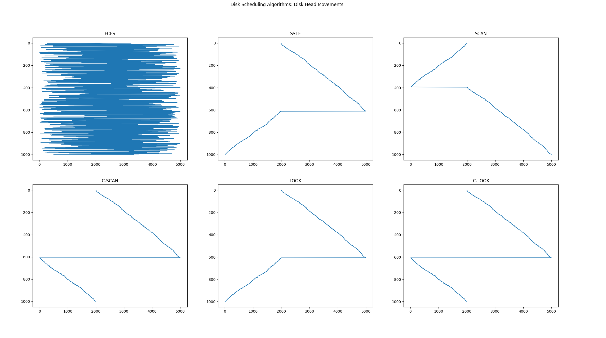

# Report - Disk Scheduling Algorithm

## Authors

- [Soham Tripathy](https://github.com/Archaic-Mage)

## Problem Introduction

Write a program that implements the following disk-scheduling algorithms:

- FCFS
- SSTF
- SCAN
- C-SCAN
- LOOK
- C-LOOK

Your program will service a disk with 5,000 cylinders numbered 0 to 4,999. The program will
generate a random series of 1,000-cylinder requests and service them according to each of the
algorithms listed above. The program will take two arguments, initial position of the disk head
(default value 2000) and the algorithm to be used. The program will output the sequence in
which the requests were served and after the sequence it will print the average & total amount
of head movement for the requests.

## Results

### First-come First-serve (FCFS)

```text
Average Head Movement: 1737.99
Total Head Movement: 1737989
```

### Shortest Seek Time First (SSTF)

```text
Average Head Movement: 7.987
Total Head Movement: 7987
```

### SCAN

```text
Average Head Movement: 6.992
Total Head Movement: 6992
```

### C-SCAN

```text
Average Head Movement: 9.997
Total Head Movement: 9997
```

### LOOK

```text
Average Head Movement: 7.971
Total Head Movement: 7971
```

### C-LOOK

```text
Average Head Movement: 9.957
Total Head Movement: 9957
```

## Observations

Each Algorithm is defined as follows:

### FCFS

In FCFS, the requests are addressed in the order they arrive in the disk queue.

**Advantages**

- Every request gets a fair chance
- No indefinite postponement

**Disadvantages**

- Does not try to optimize seek time
- May not provide the best possible service

### SSTF

In SSTF (Shortest Seek Time First), requests having shortest seek time are executed first. So, the seek time of every request is calculated in advance in the queue and then they are scheduled according to their calculated seek time. As a result, the request near the disk arm will get executed first. SSTF is certainly an improvement over FCFS as it decreases the average response time and increases the throughput of system.Let us understand this with the help of an example.

**Advantages**

- Average Response Time decreases
- Throughput increases

**Disadvantages**

- Overhead to calculate seek time in advance
- Can cause Starvation for a request if it has higher seek time as compared to incoming requests
- High variance of response time as SSTF favours only some requests

### SCAN

In SCAN algorithm the disk arm moves into a particular direction and services the requests coming in its path and after reaching the end of disk, it reverses its direction and again services the request arriving in its path. So, this algorithm works as an elevator and hence also known as elevator algorithm. As a result, the requests at the midrange are serviced more and those arriving behind the disk arm will have to wait.

**Advantages**

- High throughput
- Low variance of response time
- Average response time

**Disadvantages**

- Long waiting time for requests for locations just visited by disk arm

### C-SCAN

n SCAN algorithm, the disk arm again scans the path that has been scanned, after reversing its direction. So, it may be possible that too many requests are waiting at the other end or there may be zero or few requests pending at the scanned area.

These situations are avoided in CSCAN algorithm in which the disk arm instead of reversing its direction goes to the other end of the disk and starts servicing the requests from there. So, the disk arm moves in a circular fashion and this algorithm is also similar to SCAN algorithm and hence it is known as C-SCAN (Circular SCAN).

**Advantages**

- Provides more uniform wait time compared to SCAN

### LOOK

It is similar to the SCAN disk scheduling algorithm except for the difference that the disk arm in spite of going to the end of the disk goes only to the last request to be serviced in front of the head and then reverses its direction from there only. Thus it prevents the extra delay which occurred due to unnecessary traversal to the end of the disk.

### C-LOOK

As LOOK is similar to SCAN algorithm, in similar way, CLOOK is similar to CSCAN disk scheduling algorithm. In CLOOK, the disk arm in spite of going to the end goes only to the last request to be serviced in front of the head and then from there goes to the other end’s last request. Thus, it also prevents the extra delay which occurred due to unnecessary traversal to the end of the disk.

It is observed that 'scan' algorithm gives the best results for the particular random test case, where head starts from 2000, and requests lie from 0 to 4999.

The Graph below helps in understanding the head movements for each algorithm.



## Conclusions

We can say that for specific type of situations, certain algorithms perform better. But in general 'LOOK' should provide the better scheduling for the disk access requests.
